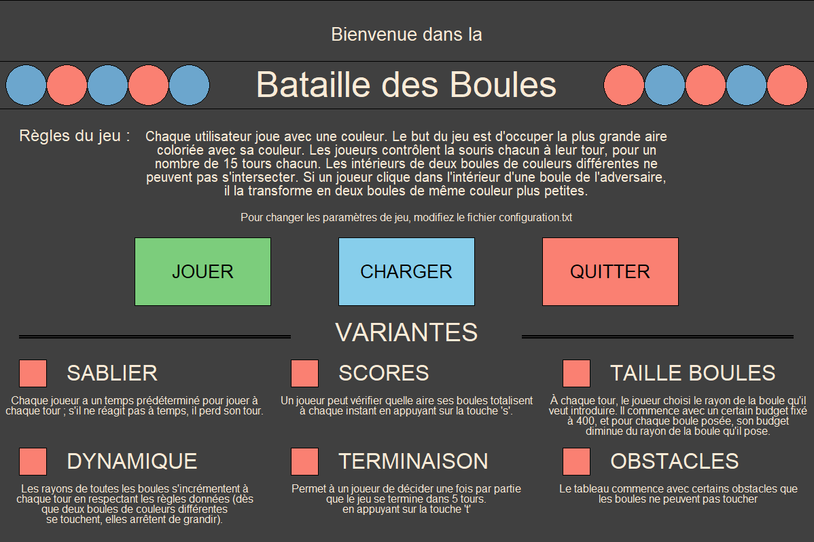
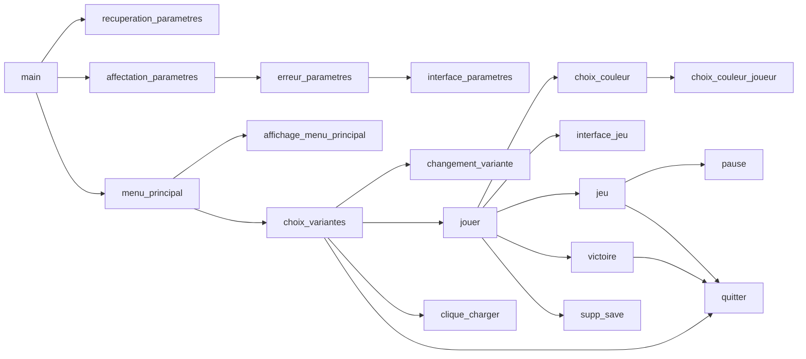

# La Bataille des Boules !

Projet de BUT Informatique codé en `Python` et réalisé en binome.

# Règles du jeu
Chaque utilisateur joue avec une couleur. Le but du jeu est d’occuper la plus grande aire coloriée avec sa couleur. Les joueurs contrôlent la souris chacun leur tour, pour un nombre de 15 tours chacun. Les intérieurs de deux boules de couleurs différentes ne peuvent pas s’intersecter. Si un joueur clique dans l’intérieur d’une boule de l’adversaire, il la transforme en deux boules, de même couleur, plus petites.

## Variantes qui ont été implémentées

 - [x] **Variante Sablier** : chaque joueur a 5 secondes pour jouer à chaque tour ; s’il ne réagit pas à temps, il perd son tour.
 - [x] **Variante Scores** : un joueur peut vérifier quelle aire ses boules totalisent à chaque instant en appuyant sur la touche ’s’. On affiche le score pour les deux joueurs, et il disparaît après 2 secondes.
 - [x] **Variante Taille des boules** : à chaque tour, on demande au joueur le rayon de la boule qu’il veut introduire. Il commence avec un budget de 400, et pour chaque boule posée, son budget diminue du rayon de la boule qu’il pose.
 - [x] **Variante Dynamique** : les rayons de toutes les boules s’incrémentent à chaque tour, dès que deux boules de couleurs différentes se touchent, elles arrêtent de grandir.
 - [x] **Variante Terminaison** : permet à un joueur de décider une fois par partie que le jeu se termine dans 5 tours chacun en appuyant sur la touche ’t’.
 - [x] **Variante Obstacles** : le jeu commence avec certains obstacles que les boules ne peuvent pas toucher.

## Bonus qui ont été implémentés

 - [x] **Bonus Création des obstacles** : Possibilité de charger une aire de jeu agrémentée d’obstacles à partir d’un fichier texte contenant leur description et leurs emplacements. Deux types d'obstacles : des cercles et des rectangles. Choix possible parmi trois niveaux de difficulté.
 - [x] **Bonus Pause et sauvegarde** : Possibilité de mettre en pause le jeu et de reprendre la partie, et de sauvegarder l’état du jeu à ce moment-là, ainsi que la possibilité de charger une partie sauvegardée en début de jeu. Si lors de la charge d’une partie, le format mémorisé dans le fichier de sauvegarde n'est pas le même que sur la fenêtre de jeu à ce moment là, on affiche un message d’erreur et réouvre le jeu au bon format.
 - [x] **Bonus Sauvegarde des paramètres** : Possibilité de choisir quelques paramètres du dans le fichier de configuration : `configuration.txt`. Paramètres pouvant être fixés : largeur de la fenêtre, hauteur de la fenêtre, largeur de l’aire de jeu, hauteur de l’aire de jeu, nombre de tours, rayon des cercles, budget des joueurs, increment pour dynamique et temps pour sablier. Nous vous recommandons vivement de lire les commentaires présents dans le fichier pour comprendre comment fonctionne le fichier de configuration et quelles sont les valeurs à privilégier pour jouer le plus agréablement possible.

## Organisation du programme

Nous commençons par récupérer les valeurs de configuration grâce à la fonction **recuperer_configuration()**. Nous les mettons ensuite en place et vérifions que les valeurs sont correctes. Si ce n'est pas le cas, on affiche un message d'erreur et on ferme le jeu en expliquant ce qui ne va pas.
Lorsque tout est correctement chargé, après avoir créé une fenêtre, le programme appelle la première fonction **menu_principal()** qui affichera le menu principal, permettant à l'utilisateur de choisir les variantes, de jouer, de charger une sauvegarde ou de quitter. 
S'il choisit des variantes, on récupère une valeur booléenne selon si la case est cochée ou non.
Si l'utilisateur choisit de charger une sauvegarde, alors nous allons charger les valeurs de la sauvegarde et les appliquer grâce à la fonction **clique_charger()**, tout en vérifiant qu'elles sont compatibles avec celles chargées précédemment. Si ce n'est pas le cas, nous réouvrons le jeu au bon format.
Si l'utilisateur lance le jeu, alors cela va appeler la fonction **jouer()** avec en paramètres les valeurs des variantes, qui va appeler tour à tour les fonctions nécessaires au déroulement du jeu.
À commencer par la fonction choix couleur qui permet aux deux joueurs de choisir la couleur de ses boules.
Ensuite, l'interface de jeu se lance avec **interface_jeu()**. Nous avons ensuite appelé la fonction **jeu()** pour obtenir la liste des cercles des deux joueurs.
Si le joueur a choisi la variante obstacles, alors nous lui proposons de les charger aléatoirement, ou bien de choisir un niveau parmi trois : Facile, Intermédiaire et Difficile.
Le programme va donc exécuter le jeu. À chaque clic, nous faisons appel à d'autres fonctions pour vérifier toutes les possibilités de placement (ex: **verfier_hors_aire()**, ...) et renvoyer le résultat correspondant à cette possibilité.
Bien sûr l'un des joueurs peut toujours choisir de cliquer sur quitter, ce qui va lancer un nouvel appel à la fonction **quitter()** ou de mettre en pause le jeu grâce à la fonction **pause()**, puis de sauvegarder et quitter ou bien de reprendre le jeu.
Finalement, en faisant appel à la fonction **victoire()** le score est calculé avec la fonction **scores()** prenant en paramètres les listes obtenues.
Selon le score le plus élevé, nous affichons l'écran de victoire pour le joueur gagnant.
Les joueurs peuvent alors rejouer ou quitter.
De plus, s'ils jouaient sur une partie chargée, ils peuvent supprimer la sauvegarde grâce à la fonction **supp_save()**.

## Choix techniques

|Choix techniques           |Raisons                                                         |
|---------------------------|----------------------------------------------------------------|
|`Python 3.11.0`            |Plus rapide et possède un système d'erreur enrichi              |
|`upemtk (basé sur tkinter)`|Pour l'interface graphique car imposé dans le cadre de ce projet|
|`Visual Studio Code`       |Pour le développement                                           |

- - -

|Modules                    |Fonctions                                               |
|---------------------------|--------------------------------------------------------|
|time                       | time et sleep                                          |  
|datetime                   | datetime                                               | 
|random                     | randint                                                |  
|math                       | sqrt                                                   |  
|os                         | path.join, path.dirname, path.exists, listdir et remove|  
|json                       | load et loads                                          |  
